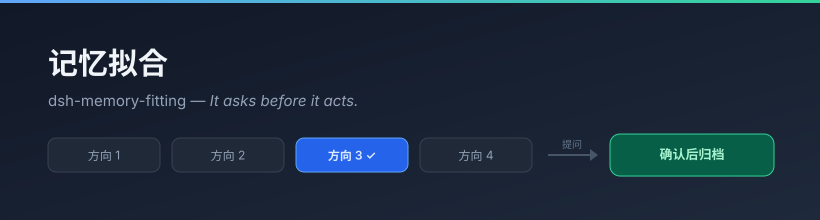

# 先问清楚，再动手 · 记忆拟合

<p align="center">
  <a href="./README.md"></a>
  <a href="./README_EN.md"></a>
</p>

<p align="center">
  <a href="https://www.npmjs.com/package/@a9i5k4/dsh-memory-fitting"></a>
  <a href="LICENSE"></a>
  
</p>

**dsh-memory-fitting** — *It asks before it acts.*

> **中文** 你先别急着说清楚，让它先猜。猜错了你纠正，比从头描述便宜得多。
> **EN** The agent predicts a few directions first, then asks in batches until one converges.

<p align="center">
  
</p>

<p align="center">
  <a href="./USER-GUIDE.md"><strong>📖 用户手册</strong></a> ·
  <a href="./docs/TRAINING.md"><strong>🧪 训练路线图</strong></a> ·
  <a href="./CHANGELOG.md">更新日志</a>
</p>

---

## 这是什么

大多数时候，卡住我们的不是"不会做"，是"说不清要什么"。

你丢给 AI 一句「帮我把这块弄好一点，感觉不太行」，它只能靠猜。猜对了是运气，猜错了就是一轮返工。**空转的 token 和你的时间，都花在猜上。**

记忆拟合把顺序换了一下：

> **不让 AI 猜，让它先立靶子，再问你。**

它先写下 3-5 个"你可能想要的方向"，然后针对**这些方向之间还分不开的地方**批量提问。你每答一轮，它就重算一次各方向的可信度，并**把更新后的方向列表摆在你眼前**。收敛到足够清楚时，它给出提案：「我理解你要的是 X，对吗？」

**你不需要描述需求，只需要纠正它的猜测。** 而纠正的成本，远低于从头描述。

---

## 它是怎么工作的

```
① 预判    AI 先写下 3-5 个"你可能想要的方向"
          （每个方向都写清：它是什么、如果成立会有什么表现）
                 ↓
② 出题    针对"方向之间的差异"设计本轮 2-4 个问题
          不问已知的；问题要能分开当前还分不开的方向
                 ↓
③ 问一批  await ctx.userQuestions.ask({ questions: [...] })
          一次问一批，一次拿回全部答案
                 ↓
④ 思考    消化本轮全部回答 → 更新方向（升降 / 淘汰 / 新增 / 合并）
          【并展示给用户】← 这一步不能省
                 ↓
          某一方向明显领先且稳定？
                 │                │
                否                是
                 │                ↓
                 └──► 回到 ②   ⑤ 提案：我理解你要的是 X（附上落选方向）
                                     ↓
                              ⑥ 你确认 → 归档
```

### 第 ④ 步的"展示"为什么不能省

| | 没有展示 | 有展示 |
|---|---|---|
| AI 的结论 | "我懂了"（不可验证的自我报告） | "我认为方向 3 领先，方向 1 已排除"（**可验证**） |
| 你要做的 | 等结果，错了才发现 | 一眼看出它想歪没有，当场纠正 |

**把 AI 的理解摆在明处，是这个插件和"AI 随便问问然后说懂了"的唯一实质区别。**

---

## 界面

右下角悬窗：**设置页**（默认）· **留档浏览** · **发起拟合**。

### 位置策略：独立列，不与任何插件打架

DSH 的右下角本来就是一摞（dsh-cua 与 Ark9Canvas 都用"探测对方 FAB"来栈叠，但**互不感知**）：

| 插件 | FAB | 面板 |
|---|---|---|
| dsh-cua | right:16 bottom:96 | right:16 bottom:152 |
| Ark9Canvas | right:16 bottom:96\|148 | right:16 bottom:152\|204 w-440 |
| **本插件** | right:16 **bottom:16** | **right:472** bottom:16 · 高 min(78vh,660px) |

本插件的 FAB 在摞的最底部；面板移到右侧那一列的**左边**，纵向拉满 —— 与 `right:16` 那一列完全错开，**无论对方开不开面板都不会重叠**。窄屏（<900px）自动降级为居中浮层。

---

## 开关：默认全关

这个插件会很克制地不打扰你。三个"污染面"开关**默认全部关闭**：

| 开关 | 默认 | 说明 |
|---|---|---|
| `injectContext` | **关** | 每轮注入一段极短说明，让模型知道可主动发起拟合 |
| `writeMemory` | **关** | 把收敛结论写进 dsh-auto-memory |
| `exposeTools` | **关** | 向模型暴露 `memory_fit_*` 工具（注册即占每轮 tool 上下文） |
| `localArchive` | **开** | 插件自己的本地留档 |

**为什么默认关**：统一 API 下每轮注入都要付 token 租金，而且注入越频繁，模型对它的注意力越衰减。正确策略不是"注入更多"，而是"注入得始终有分量"——所以默认不注入，只在需要时开。

不想改开关也能直接用：悬窗里点「开始拟合」，不需要模型可见任何工具。

---

## 数据在哪

```
~/.dsh/memory-fitting/
  config.json                              配置
  sessions/<stamp>-<id>.jsonl              拟合全过程（append-only，绝不重写）
  sessions/index.json                      索引（可重建）
```

**过程存自己、结论进记忆。** 完整问答轨迹落在本地 JSONL，不受任何外部插件的容量整理影响；只有收敛结论才按 `writeMemory` 开关决定是否写进记忆插件。

> 这些留档不只是日志 —— 它们是**训练就绪**的样本。见 [训练路线图](docs/TRAINING.md)。

---

## ⚠️ 记忆写入安全带

`src/node/sanitize.js` 对**所有**要写进记忆插件的内容做**字符级改写**。

**背景**：dsh-auto-memory 的写入侧**不过滤**待写入正文（`appendAnchoredRecord` 只对已有文件内容跑 `parseAnchors`）。正文里一旦出现 HTML 注释形式的 memory 锚点起始序列，该文件其后**所有**记忆写入全部被 fail closed 拒绝 —— **整个记忆文件锁死**。

**关键：转义无效。** 反引号、代码块、HTML 实体统统不认。**必须改写措辞。**

因为拟合记录**天然包含用户原话**，本插件在归档前强制过 `guard()`。这也是"用户原话只进本地 JSONL、只有改写后才进记忆"的原因。

---

## 安装

```bash
dsh plugin --profile web add @a9i5k4/dsh-memory-fitting
```

或手动：把包链接到 profile 的 `node_modules`，并在 `dsh.profile.bundles` 里加上 `@a9i5k4/dsh-memory-fitting`。

改完 host 侧代码需要重新 `node build.mjs` 并**重启 dsh web**。

---

## 开发

```bash
npm install       # 只有 esbuild 一个构建依赖
npm run build     # → lib/index.js (node) + lib/client.js (browser)
npm test          # 51 项回归
npm run verify    # 产物依赖面与安全自检
```

### 设计上的几个硬约束

- **拟合只能由会话根代理发起**：传了 `agent` 的子代理会撞 `DELEGATED_CALLER`。本插件把 `agent` 作为可选透传，走全局 waterfall 兜底。
- **`ctx.userQuestions` 不写进 `inject`**：它是可选能力，缺失时应降级而不是整个插件加载失败。
- **上下文注入用祈使式 + 触发条件**，不是描述式。模型对"背景资料"与"必须执行的约束"处理深度不同，同样的 token 数后者影响大得多。
- **node 侧零外部包依赖，client 侧零 `require`** —— 彻底规避"漏一个 require 整个插件加载失败"。

---

## 缘起

这个插件移植自一个 SSVEP 脑机接口项目的「意图拟合」环节。

在那个场景里，用户是瘫痪人群，**唯一能表达意图的通道是脑电**——系统不能等他把需求说清楚，只能反复给出少量候选，靠每次选择反推意图，逐步收敛。

把它推广到日常：当一个人的输出带宽很低（说不清、没想明白、或者就是懒得说），而 AI 的先验又很宽时，**"先立靶子再问"比"直接猜"要省得多**。

---

## License

MIT © Aik358
